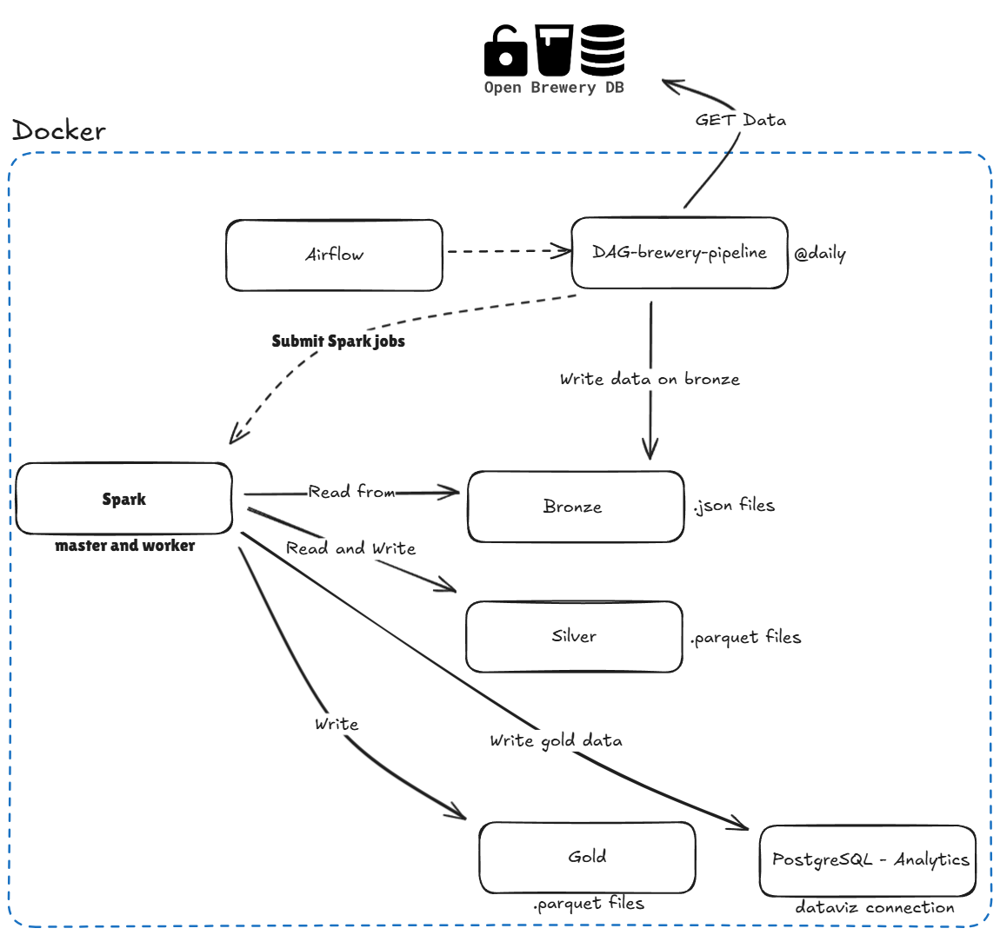

# Brewery Data Pipeline with Medallion Architecture

## Overview
This project implements a robust data pipeline for collecting, processing, and analyzing brewery data from the OpenBreweryDB API. It leverages the Medallion Architecture to organize data across Bronze, Silver, and Gold layers, utilizing Apache Airflow for orchestration, MinIO for data storage, and PostgreSQL for analytics. The data is extracted, transformed, loaded, and enriched, providing valuable insights into brewery types and locations.

## Architecture

The pipeline adheres to the Medallion Architecture:

*   **Bronze Layer:** Stores raw data from the OpenBreweryDB API in JSON format within MinIO. This layer preserves the original data in its unmodified state.
*   **Silver Layer:** Transforms the raw JSON data into a columnar Parquet format, partitioning it by state for efficient querying. This layer includes data cleaning and standardization.
*   **Gold Layer:** Aggregates the transformed data to provide a summarized view of brewery counts by type and location. This data is written to both MinIO in Parquet format and PostgreSQL for direct analytical querying.
  
## Architecture Diagram



## Technologies

*   **Apache Airflow:** Orchestrates the DAG, scheduling and managing task dependencies.
*   **Python:** Main language for implementing custom operators, API requests, and core logic.
*   **Apache Spark (PySpark):** Processes large-scale data transformations for the Silver and Gold layers.
*   **MinIO:** Provides S3-compatible object storage for the Bronze, Silver, and Gold data layers.
*   **PostgreSQL:** Stores aggregated Gold layer data for analytical querying.
*   **Docker:** Containerizes the application for portability and consistency.

## Prerequisites

*   [Docker](https://www.docker.com/)

## Setup and Installation

1.  **Clone the repository:**

    ```bash
    git clone https://github.com/henrique-af/datalakehouse-breweries.git
    cd datalakehouse-breweries
    ```

2.  **Start the services using Docker Compose:**

    ```bash
    docker-compose up --build
    ```

    This command builds the required Docker images, starts all services in detached mode, and sets up Airflow, MinIO, and PostgreSQL.

3.  **Access the Airflow Web Interface:**

    Open your web browser and navigate to `http://localhost:8080`.
    Use the following credentials:

    *   **Username:** `admin`
    *   **Password:** `admin`

4.  **Activate the DAG:**

    *   Log in to the Airflow web interface.
    *   Locate the `brewery_API_pipeline` DAG in the list of DAGs.
    *   Toggle the switch in the `On/Off` column to enable the DAG.

## Access Credentials

### Airflow Web Interface:

*   **Username:** `admin`
*   **Password:** `admin`

### MinIO:

*   **Access Key:** `minio`
*   **Secret Key:** `minio123`

    Buckets used:
    *   `bronze`
    *   `silver`
    *   `gold`

### PostgreSQL:

*   **Host:** `postgres-analytics`
*   **Port:** `5432`
*   **Database:** `brewery_analytics`
*   **User:** `analytics`
*   **Password:** `analytics123`

## DAG Structure and Routines

The `brewery_test` DAG consists of the following tasks:

1.  **`check_api`:**
    *   **Purpose:** Verifies the availability of the OpenBreweryDB API before proceeding with the pipeline.
    *   **Technology:** `HttpSensor` from Airflow.
    *   **Routine:** Sends an HTTP GET request to the API endpoint and checks for a 200 OK response.
2.  **`ensure_buckets`:**
    *   **Purpose:** Ensures that the required MinIO buckets (`bronze`, `silver`, `gold`) exist.
    *   **Technology:** Custom `EnsureBucketsExistOperator`.
    *   **Routine:** Connects to MinIO and creates the buckets if they don't already exist.
3.  **`extract_data`:**
    *   **Purpose:** Extracts brewery data from the OpenBreweryDB API.
    *   **Technology:** Custom `APIExtractorOperator`.
    *   **Routine:** Makes an HTTP GET request to the API, retrieves the JSON response, and pushes the data to XCom for downstream tasks.
4.  **`write_to_bronze`:**
    *   **Purpose:** Writes the raw JSON data to the Bronze layer in MinIO.
    *   **Technology:** Custom `WriteDataToBronzeOperator`.
    *   **Routine:** Retrieves the data from XCom, converts it to JSON format, and uploads it to the `bronze` bucket in MinIO, naming the file with a timestamp.
5.  **`get_latest_file`:**
    *   **Purpose:** Identifies the most recent JSON file in the Bronze layer for processing.
    *   **Technology:** Custom `GetLatestFileFromBronzeOperator`.
    *   **Routine:** Lists all objects in the `bronze` bucket, filters out the processed/ folder, and determines the latest file based on the last modified timestamp, pushing it to XCom for use in downstream tasks.
6.  **`transform_to_silver`:**
    *   **Purpose:** Transforms the raw JSON data into a curated Parquet format in the Silver layer.
    *   **Technology:** Custom `TransformBronzeToSilverOperator` and Apache Spark.
    *   **Routine:**
        *   Initializes a Spark session.
        *   Reads the JSON data from MinIO using the identified filename.
        *   Applies data cleaning and transformation logic (renaming columns, changing data types, handling missing values).
        *   Writes the transformed data to the `silver` bucket in Parquet format, partitioned by `state`.
        *   Stops the Spark session.
7.  **`data_quality_check`:**
    *   **Purpose:** Performs data quality checks on the transformed data in the Silver layer.
    *   **Technology:** Custom `DataQualityOperator` and Apache Spark.
    *   **Routine:**
        *   Initializes a Spark session.
        *   Reads the Parquet data from the `silver` bucket.
        *   Validates the data against predefined quality rules, such as minimum record counts and presence of critical columns.
        *   Raises an exception if any data quality checks fail, which causes the Airflow task to fail.
        *   Stops the Spark session.
8.  **`move_to_processed`:**
    *   **Purpose:** Moves the processed JSON file from the Bronze layer to a `processed` folder for archiving and organization.
    *   **Technology:** Custom `MoveFileToProcessedOperator` and MinIO client.
    *   **Routine:** Connects to MinIO and moves the original JSON file to a subfolder named `processed` within the `bronze` bucket. Creates the folder if it doesn't exist.
9.  **`ensure_postgres_schema`:**
    *   **Purpose:** Ensures that the `gold_layer` schema exists in the PostgreSQL database.
    *   **Technology:** Custom `EnsurePostgresSchemaOperator` and `psycopg2` library.
    *   **Routine:** Connects to PostgreSQL and executes a `CREATE SCHEMA IF NOT EXISTS` statement to ensure the schema is available.
10. **`aggregate_silver_to_gold`:**
    *   **Purpose:** Aggregates the transformed data from the Silver layer and writes it to the Gold layer in MinIO.
    *   **Technology:** Custom `AggregateSilverToGoldOperator` and Apache Spark.
    *   **Routine:**
        *   Initializes a Spark session.
        *   Reads the Parquet data from the `silver` bucket.
        *   Aggregates the data by brewery type and state, counting the total number of breweries.
        *   Writes the aggregated data to the `gold` bucket in Parquet format.
        *   Pushes the path to the Gold data to XCom for downstream tasks.
        *   Stops the Spark session.
11. **`write_gold_to_postgres`:**
    *   **Purpose:** Writes the aggregated data from the Gold layer to a table in the PostgreSQL database.
    *   **Technology:** Custom `WriteGoldToPostgresOperator` and Apache Spark.
    *   **Routine:**
        *   Initializes a Spark session.
        *   Reads the Parquet data from the `gold` bucket.
        *   Constructs a JDBC URL to connect to the PostgreSQL database.
        *   Writes the DataFrame to a table named `gold_layer.brewery_summary`, overwriting any existing data.
        *   Stops the Spark session.

## Testing

The project includes unit tests to validate the functionality of individual components.

*   **To run tests:**

    ```bash
    docker exec -it airflow-webserver pytest /opt/airflow/tests -v
    ```

### Key test files:

    *   `tests/test_silver_transformation.py`: Contains tests for data transformation logic in the Silver layer.
    *   `tests/test_write_data_bronze.py`: Contains tests for writing data to the Bronze layer in MinIO.

## Monitoring

Airflow provides built-in monitoring through its UI.

*   To monitor the DAG runs, check the DAG's status in the Airflow web interface.
*   Examine the task logs for detailed information about each task's execution.
  
## Trade-offs & Design Choices
1. Why Airflow?

* Provides robust orchestration with built-in retries, scheduling, and monitoring.
* Easily extensible with custom operators for specific tasks like API extraction or Spark transformations.

2. Why PySpark?

* Scalable for large datasets due to its distributed processing capabilities.
* Allows seamless integration with MinIO (S3-like storage) and PostgreSQL via JDBC.

3. Challenges Faced:

* Setting up Spark with MinIO required additional configuration (Hadoop AWS JARs).
* Ensuring compatibility between Airflow, MinIO, and PostgreSQL within Docker containers required careful orchestration.